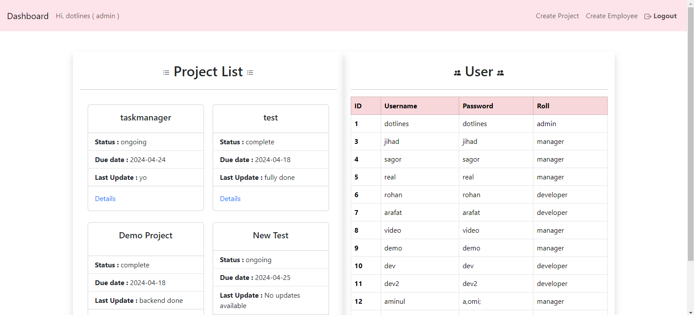

<a name="readme-top"></a>

<!-- PROJECT LOGO -->
<br />
<div align="center">

  <h3 align="center">Task Manager</h3>

  <p align="center">
    Django, Bootstrap, MySQL
    <br />
    <br />
    <a href="https://github.com/othneildrew/Best-README-Template">Demo Youtube Video</a>
    ·
    <a href="https://github.com/othneildrew/Best-README-Template/issues">Report Bug</a>
  </p>
</div>


<!-- TABLE OF CONTENTS -->
<details>
  <summary>Table of Contents</summary>
  <ol>
    <li>
      <a href="#about-the-project">About The Project</a>
      <ul>
        <li><a href="#built-with">Built With</a></li>
      </ul>
    </li>
    <li>
      <a href="#getting-started">Getting Started</a>
      <ul>
        <li><a href="#prerequisites">Prerequisites</a></li>
        <li><a href="#installation">Installation</a></li>
      </ul>
    </li> 
    <li><a href="#license">License</a></li>
    <li><a href="#contact">Contact</a></li>
    <li><a href="#acknowledgments">Acknowledgments</a></li>
  </ol>
</details>


<!-- ABOUT THE PROJECT -->
## About The Project

The task management system developed for the startup aims to provide a robust platform for streamlining project workflows within the organization. It caters to both internal teams and external clients, offering features that facilitate effective communication, task tracking, and project management. The system is designed to be intuitive and feature-rich, enhancing productivity and collaboration among team members.

<div align="center">
  
</div>

## Functional Requirements

1. **User Management:**
- Administrator can create and manage user accounts, including different roles such as Administrator, Project Manager, and Developer.
- Each user has specific permissions and access levels based on their role.
  
2. **Project Creation:**
- Administrators can create new projects, specifying details such as project name, and deadline, and assigning a project manager.
- The project creation form includes a selection menu for assigning a project manager.

3. **Dashboard:**
- Upon login, users are greeted with a dashboard displaying project details.
- The dashboard shows the project name, completion status, last update, and due date.
- Project Managers can only view projects assigned to them.

4. **Project Details Page:**
- Users can access detailed information about a specific project.
- The project details page displays status updates and relevant team members assigned to the project along with their roles.
- Developers can provide updates on project progress, including comments and completion percentages.

5. **Project Completion:**
- Project Managers can mark a project as completed once the completion status reaches 100%.
- Completion status is updated based on the progress provided by developers.
- A "complete" button is available for Project Managers to change the status of ongoing projects to complete.

## Non-Functional Requirements:

1. **Usability:**
- The system should be intuitive and easy to navigate for all users.
- User interfaces should be designed for efficient task management and minimal cognitive load.

2. **Scalability:**
- The system should be scalable to accommodate the growing number of users and projects over time.
- Database and server infrastructure should be designed to handle increased loads without compromising performance.

3. **Reliability:**
- The system should be reliable and available, with minimal downtime for maintenance or upgrades.
- Backup and recovery mechanisms should be in place to prevent data loss in case of system failures.


<p align="right">(<a href="#readme-top">back to top</a>)</p>

## Use Case Diagram
<div align="center">
  
</div>

<p align="right">(<a href="#readme-top">back to top</a>)</p>

## ER Diagram
<div align="center">
  
</div>

<p align="right">(<a href="#readme-top">back to top</a>)</p>

### Built With

* Bootstrap
* Django
* Mysql


<p align="right">(<a href="#readme-top">back to top</a>)</p>


<!-- GETTING STARTED -->
## Getting Started

This is an example of how you may give instructions on setting up your project locally.
To get a local copy up and running follow these simple example steps.

### Prerequisites

Before running the project makesure you meet all the prerequisites.
* python 3.11.5
* MySQL

### Installation

Follow the below step by step process to install Taskmanager into the testbench.

1. Clone the repo
   ```sh
   git clone https://github.com/mostakimjihad/TaskManager.git
   ```
   ```sh
   cd TaskManager
   ```
2. Import Database Dump
   ```sh
   mysql -u username -p database_name < dump_file.sql
   ```
   ```
3. Apply Migrations
   ```sh
   python manage.py migrate
   ```
4. Run the Development Server
   ```sh
   python manage.py runserver
   ```

<p align="right">(<a href="#readme-top">back to top</a>)</p>


<!-- LICENSE -->
## License

Distributed under the MIT License. See `LICENSE.txt` for more information.

<p align="right">(<a href="#readme-top">back to top</a>)</p>


<!-- CONTACT -->
## Contact

Mostakim Jihad - [@MostakimJihad](https://twitter.com/MostakimJihad) - mostakimjihad652001@gmail.com

Project Link: [https://github.com/your_username/repo_name](https://github.com/your_username/repo_name)

<p align="right">(<a href="#readme-top">back to top</a>)</p>


<!-- ACKNOWLEDGMENTS -->
## Acknowledgments

This project is supervised by,

* [Dotlines](https://dotlines.com.sg/)

<p align="right">(<a href="#readme-top">back to top</a>)</p>


